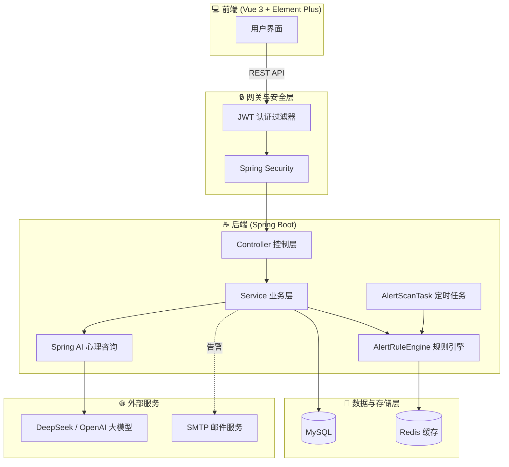
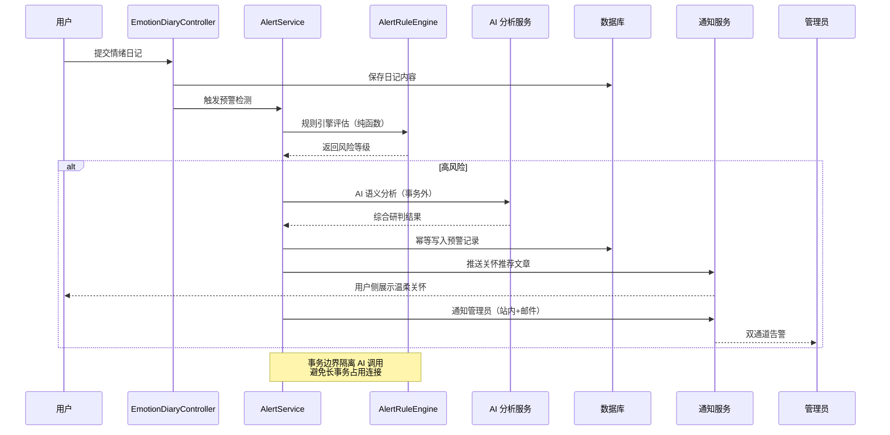
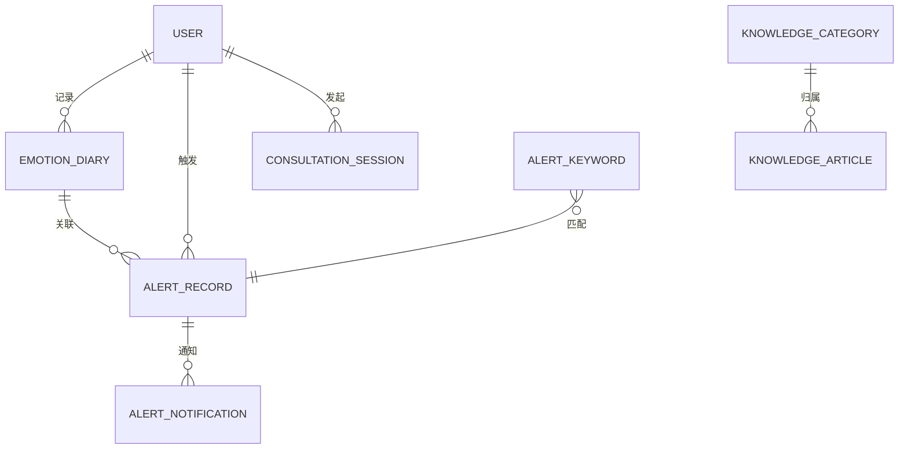

<div align="center">

# 🧠 AI 智能心理健康助手

**基于 Spring Boot + Vue 3 的全栈心理健康服务平台，集成大模型心理咨询、情绪追踪与危机预警系统**

[](https://www.oracle.com/java/)
[](https://spring.io/projects/spring-boot)
[](https://docs.spring.io/spring-ai/reference/)
[](https://vuejs.org/)
[](https://baomidou.com/)
[](LICENSE)

</div>

> 一个面向真实场景的心理健康平台：用户可以与 AI 心理咨询师对话、记录情绪日记、阅读心理科普文章；系统会通过**双轨检测机制**实时识别潜在的心理危机，自动推荐关怀内容并通知管理员。

---

## 📖 项目简介

随着生活节奏加快，心理健康问题日益普遍，但专业的心理咨询服务存在资源稀缺、价格高昂、隐私顾虑等门槛。本项目旨在构建一个**7×24 小时在线的 AI 心理健康助手**，让用户随时可以获得倾听、疏导与知识陪伴。

平台同时内置了**危机预警模块**——这是项目最具技术深度的部分：通过纯函数式规则引擎 + AI 语义分析的双轨机制，在用户写下负面情绪时第一时间识别自杀、自残等高危信号，并触发关怀推荐与人工介入流程。

### 🎯 栀心价值

| 用户视角 | 平台能力 |
|---------|---------|
| 随时倾诉，不必等待预约 | 大模型驱动的拟人化心理咨询对话 |
| 记录情绪，了解自我 | 结构化情绪日记 + 可视化趋势分析 |
| 学习心理知识，自我调节 | 分类知识库 + 智能文章推荐 |
| 危机时刻被看见、被关怀 | 双轨危机检测 + 主动推荐 + 管理员通知 |

---

## ✨ 核心亮点

### 🔥 危机预警模块（面试讲解重点）

这是本项目最具技术含量的模块，采用多种工程化设计模式保证**实时性、可靠性、可扩展性**：

- **双轨检测机制**：实时检测（日记提交即触发）+ 凌晨定时批量扫描，兼顾响应速度与资源效率
- **纯函数式规则引擎**：无状态的 `AlertRuleEngine`，基于关键词匹配与评分算法评估风险等级，易于测试与扩展
- **事务边界管理**：将耗时的 AI 调用从事务中隔离，避免长事务占用数据库连接
- **幂等设计**：通过唯一约束 + 并发保护，防止同一日记重复触发预警
- **降级容错**：邮件服务（SMTP）不可用时自动降级，保证核心预警流程不中断
- **AI 客户端隔离**：为不同 AI 任务配置独立的 `ChatClient`，避免 Prompt 污染与资源竞争
- **双通道通知**：站内通知 + 邮件通知管理员，确保高危预警不遗漏
- **用户关怀设计**：对用户侧文案采用去污名化语言，推荐心理科普文章而非生硬警示

---

## 🛠️ 技术栈

### 后端（ai-springboot）

| 分类 | 技术 | 版本 | 用途 |
|------|------|------|------|
| 基础框架 | Spring Boot | 4.1.0 | 应用骨架 |
| 语言 | Java | 17 | 编程语言 |
| AI 集成 | Spring AI | 2.0.0 | 大模型对话（OpenAI 兼容协议） |
| ORM | MyBatis-Plus | 3.5.16 | 数据库访问与分页 |
| 数据库 | MySQL | 8.x | 持久化存储 |
| 安全 | Spring Security + JWT | java-jwt 4.4.0 | 认证与鉴权 |
| 缓存 | Redis | - | 关键词缓存与会话管理 |
| 邮件 | spring-boot-starter-mail | - | 管理员告警通知 |
| 工具库 | Hutool | 5.8.25 | 通用工具与 JSON 处理 |
| 增强 | Lombok | - | 样板代码消除 |

### 前端（ai-vue）

| 分类 | 技术 | 版本 | 用途 |
|------|------|------|------|
| 框架 | Vue | 3.5.40 | 渐进式前端框架 |
| 构建 | Vite | 8.2.0 | 构建工具与开发服务器 |
| UI 库 | Element Plus | 2.14.4 | 组件库 |
| 状态管理 | Pinia | 4.0.2 | 状态管理 |
| 路由 | Vue Router | 4.6.4 | 前端路由 |
| HTTP | Axios | 1.19.0 | 请求封装 |
| 图表 | ECharts | 6.1.0 | 数据可视化 |

---

## 🏗️ 系统架构



### 危机预警模块处理流程



---

## 📦 功能模块

| 模块 | 后端入口 | 前端页面 | 说明 |
|------|---------|---------|------|
| 👤 用户认证 | `User` / `UserService` | `login.vue` | 注册、登录、JWT 鉴权 |
| 🤖 AI 心理咨询 | `PsychologicalChat` / `PsychologicalSupportService` | `consultation.vue` | 流式对话、多轮会话 |
| 📚 知识库 | `KnowledgeController` | `knowledge.vue` | 文章管理、分类浏览、用户收藏 |
| 📔 情绪日记 | `EmotionDiaryController` | `emotionDiary.vue` | 情绪记录、心情评分、标签 |
| 🚨 危机预警 | `AlertController` / `AlertService` | `alert.vue` / `care.vue` | **双轨检测、关怀推荐、管理员处置** |
| 📊 数据分析 | `DataAnalyticsController` | `dashboard.vue` | 用户行为、情绪趋势、咨询统计 |
| 💬 咨询记录管理 | `AdminConsultationController` | 后台管理页 | 会话回放、消息审计 |

---

## 📁 项目结构

```
ai-mental-health/
├── ai-springboot/                    # 后端 Spring Boot 服务
│   ├── src/main/java/org/example/aisprinboot/
│   │   ├── AiSprinbootApplication.java          # 🚀 启动入口
│   │   ├── controller/                          # 控制层
│   │   │   ├── User.java                        # 用户认证
│   │   │   ├── PsychologicalChat.java           # AI 对话
│   │   │   ├── KnowledgeController.java         # 知识库
│   │   │   ├── EmotionDiaryController.java      # 情绪日记
│   │   │   ├── AlertController.java             # 危机预警
│   │   │   ├── DataAnalyticsController.java     # 数据分析
│   │   │   └── AdminConsultationController.java # 咨询管理
│   │   ├── service/                             # 业务层
│   │   │   ├── alert/                           # 🚨 预警子领域
│   │   │   │   ├── AlertService.java            # 主服务
│   │   │   │   ├── AlertRuleEngine.java         # 纯函数规则引擎
│   │   │   │   ├── AlertScanService.java        # 批量扫描
│   │   │   │   ├── AlertAnalysisService.java    # AI 分析
│   │   │   │   ├── AlertNotificationService.java# 通知服务
│   │   │   │   └── ArticleRecommendationService.java # 文章推荐
│   │   │   ├── UserService.java
│   │   │   ├── KnowledgeArticleService.java
│   │   │   ├── EmotionDiaryService.java
│   │   │   └── ...
│   │   ├── entity/                              # 实体
│   │   ├── mapper/                              # MyBatis-Plus Mapper
│   │   ├── config/                              # 配置
│   │   │   ├── ChatClientConfig.java            # AI 客户端配置
│   │   │   ├── JwtConfig.java
│   │   │   ├── SecurityConfig.java
│   │   │   ├── MybatisPlusConfig.java
│   │   │   └── SchedulingConfig.java            # 定时任务
│   │   ├── enumClass/                           # 枚举
│   │   │   ├── AlertStatus.java
│   │   │   ├── AlertLevel.java
│   │   │   └── ...
│   │   ├── schedule/
│   │   │   └── AlertScanTask.java               # ⏰ 凌晨批量扫描任务
│   │   ├── AiService/                           # AI 服务封装
│   │   ├── util/                                # 工具（JWT、过滤器）
│   │   ├── common/                              # Result 统一响应、全局异常
│   │   └── DTO/                                 # 数据传输对象
│   ├── src/main/resources/
│   │   ├── application.yml                      # 实际配置（已 gitignore）
│   │   └── application.example.yml              # 配置模板（含占位符）
│   └── sql/
│       ├── init.sql                             # 基础表结构
│       ├── alert.sql                            # 危机预警模块表结构
│       └── init_data.sql                        # 知识库初始数据
│
├── ai-vue/                           # 前端 Vue 3 应用
│   ├── src/
│   │   ├── views/                               # 页面
│   │   │   ├── login.vue                        # 登录
│   │   │   ├── home.vue                         # 首页
│   │   │   ├── consultation.vue                  # AI 对话
│   │   │   ├── emotionDiary.vue                 # 情绪日记
│   │   │   ├── knowledge.vue                    # 知识库
│   │   │   ├── dashboard.vue                    # 数据分析
│   │   │   ├── alert.vue                        # 预警管理（管理员）
│   │   │   └── care.vue                         # 用户关怀页
│   │   ├── api/                                 # 接口封装
│   │   ├── router/                              # 路由配置
│   │   ├── utils/                               # 请求拦截器
│   │   └── components/                          # 公共组件
│   └── vite.config.js                           # Vite 配置（含 /api 代理）
│
├── .gitignore                        # 隐私与构建产物忽略规则
└── README.md
```

---

## 🚀 快速开始

### 环境要求

- **JDK** 17+
- **Maven** 3.8+
- **Node.js** 18+
- **MySQL** 8.0+
- **Redis** 6.0+
- 一个 OpenAI 兼容的大模型 API Key（如 [DeepSeek](https://platform.deepseek.com/)、[硅基流动](https://siliconflow.cn/)）

### 1️⃣ 克隆仓库

```bash
git clone https://github.com/2877672448-ops/ai-mental-health.git
cd ai-mental-health
```

### 2️⃣ 初始化数据库

在 MySQL 中创建数据库 `mental_health_assistant`，并依次执行 SQL 脚本：

```sql
CREATE DATABASE mental_health_assistant DEFAULT CHARACTER SET utf8mb4 COLLATE utf8mb4_unicode_ci;
USE mental_health_assistant;
```

然后按顺序导入：

```bash
mysql -u root -p mental_health_assistant < ai-springboot/sql/init.sql
mysql -u root -p mental_health_assistant < ai-springboot/sql/alert.sql
mysql -u root -p mental_health_assistant < ai-springboot/sql/init_data.sql
```

| 脚本 | 作用 |
|------|------|
| `init.sql` | 创建用户、咨询会话、知识库、情绪日记等基础表 |
| `alert.sql` | 创建危机预警模块所需表（alert_record / alert_keyword / alert_notification） |
| `init_data.sql` | 知识库初始数据（5 大分类 + 6 篇示例文章） |

### 3️⃣ 配置后端

```bash
cd ai-springboot
# 复制配置模板并填入你的真实配置
cp src/main/resources/application.example.yml src/main/resources/application.yml
```

编辑 `application.yml`，填入数据库密码、AI API Key、JWT 密钥等：

```yaml
spring:
  datasource:
    url: jdbc:mysql://localhost:3306/mental_health_assistant?useSSL=false&serverTimezone=UTC
    username: ${DB_USERNAME:root}
    password: ${DB_PASSWORD:your_db_password_here}
  ai:
    openai:
      chat:
        options:
          model: deepseek-chat
      api-key: ${AI_API_KEY:your_deepseek_api_key_here}
      base-url: https://api.deepseek.com
jwt:
  secret: ${JWT_SECRET:change_this_to_a_long_random_string}
```

> 💡 推荐使用环境变量注入敏感信息，避免硬编码。

### 4️⃣ 启动后端

```bash
cd ai-springboot
mvn spring-boot:run
# 后端启动后访问 http://localhost:8080
```

### 5️⃣ 启动前端

```bash
cd ai-vue
npm install
npm run dev
# 前端启动后访问 http://localhost:5173
```

### 6️⃣ 体验系统

- 访问 `http://localhost:5173` 注册并登录
- 在「情绪日记」中记录心情
- 尝试在日记中输入高危关键词（如「不想活了」），体验危机预警 → 关怀推荐的完整链路
- 登录管理员账号在「预警管理」查看告警记录

---

## 🗄️ 数据库设计

### 核心业务表

| 表名 | 用途 |
|------|------|
| `user` | 用户基本信息（含角色、状态） |
| `consultation_session` | AI 咨询会话 |
| `consultation_message` | 咨询消息明细 |
| `knowledge_category` | 知识分类（支持二级） |
| `knowledge_article` | 心理科普文章 |
| `emotion_diary` | 用户情绪日记 |

### 危机预警模块表

| 表名 | 用途 |
|------|------|
| `alert_keyword` | 预警关键词词典（含权重） |
| `alert_record` | 预警记录（关联用户与日记） |
| `alert_notification` | 管理员通知记录 |



---

## 💡 核心技术亮点

### 1. 纯函数式规则引擎 `AlertRuleEngine`

```text
输入：日记文本 + 关键词字典
      ↓
处理：无状态关键词匹配 → 命中权重累加 → 阈值分级
      ↓
输出：AlertRuleResult（风险等级 + 命中关键词）
```

**设计优势**：
- **无状态**：每次调用独立，天然线程安全，可水平扩展
- **可测试**：纯函数易于编写单元测试，覆盖各种边界情况
- **可扩展**：新增规则只需扩展关键词字典，无需修改引擎逻辑
- **高性能**：关键词缓存在内存，避免每次查库

### 2. 双轨检测机制

| 轨道 | 触发时机 | 目的 |
|------|---------|------|
| 实时检测 | 日记提交即触发 | 第一时间响应高危情况 |
| 定时扫描 | 凌晨低峰期批量扫描 | 兜底，捕捉实时检测遗漏的潜在风险 |

### 3. 事务边界与 AI 调用隔离

```java
// 伪代码示意
@Transactional
public void saveDiaryAndDetect(Diary diary) {
    // ✅ 事务内：仅做数据库写操作
    diaryMapper.insert(diary);
    
    // ✅ 事务外：AI 调用不占用数据库连接
    AlertRuleResult result = alertRuleEngine.evaluate(diary.getContent());
    if (result.isHighRisk()) {
        aiAnalysisService.analyzeAsync(diary); // 异步，不阻塞
    }
}
```

**为什么这样设计**：AI 调用通常耗时数秒，若放在事务内会长时间占用数据库连接，在高并发场景下会迅速耗尽连接池。

### 4. 幂等设计

- 数据库层：唯一索引 `(user_id, diary_id)` 防止重复写入
- 应用层：检测前先查询是否已存在预警记录
- 并发保护：乐观锁 / 分布式锁兜底

### 5. 降级容错

```text
邮件服务可用？ ──Yes──> 站内通知 + 邮件通知（双通道）
            │
            No ──> 仅站内通知（降级，不阻断核心流程）
```

### 6. AI 客户端隔离

为「心理咨询对话」和「危机语义分析」配置独立的 `ChatClient` 实例与 Prompt 模板，避免：
- Prompt 互相污染（咨询 Prompt 偏温暖陪伴，分析 Prompt 偏客观研判）
- 资源竞争（不同任务的并发限流策略独立）

---

## 🔒 隐私与安全

本项目高度重视用户隐私，已采取以下措施：

| 措施 | 说明 |
|------|------|
| 配置文件隔离 | `application.yml` 等含敏感信息的文件已加入 `.gitignore` |
| 配置模板 | 提供 `application.example.yml`，用 `${ENV_VAR}` 占位符替代真实凭据 |
| JWT 鉴权 | 所有业务接口需携带有效 Token |
| 密码加密 | 用户密码使用 BCrypt 加密存储 |
| 心理数据保护 | 情绪日记仅用户本人可见，管理员仅可查看脱敏统计 |

> ⚠️ **部署提醒**：生产环境请务必通过环境变量或密钥管理服务注入数据库密码、AI API Key、JWT Secret，切勿硬编码到配置文件。

---

## 🧪 体验建议

### 普通用户视角
1. 注册账号 → 登录
2. 在「AI 咨询」与心理助手对话倾诉
3. 在「情绪日记」记录今日心情
4. 在「知识库」浏览心理科普文章

### 管理员视角
1. 登录管理员账号
2. 在「数据分析」查看平台运营数据
3. 在「预警管理」查看并处置危机预警
4. 在「咨询记录」回放用户会话

### 危机预警体验
在情绪日记中输入包含高危关键词的内容（如「我撑不下去了」「不想活了」），观察：
- 用户侧：在「心灵关怀」页收到温柔的文章推荐
- 管理员侧：在「预警管理」收到告警通知

---

## 📌 版本与路线图

- [x] v1.0 基础功能：用户认证、AI 对话、知识库、情绪日记
- [x] v1.1 数据分析看板
- [x] v1.2 危机预警模块（双轨检测 + 关怀推荐）
- [ ] v2.0 接入更多大模型（多模型路由）
- [ ] v2.1 心理测评量表
- [ ] v2.2 咨询师预约对接

---

## 📄 License

本项目采用 [MIT License](LICENSE) 开源协议。

---

## 🙏 致谢

- [Spring AI](https://docs.spring.io/spring-ai/reference/) —— 优雅的 AI 集成框架
- [MyBatis-Plus](https://baomidou.com/) —— 强大的 MyBatis 增强工具
- [Element Plus](https://element-plus.org/) —— 优雅的 Vue 3 组件库
- [DeepSeek](https://www.deepseek.com/) —— 提供大模型 API 支持

---

<div align="center">

**⭐ 如果这个项目对你有帮助，欢迎 Star 支持！**

*本项目仅用于学习交流与面试展示，不构成专业医疗建议。如有心理健康困扰，请寻求专业心理咨询师或医师帮助。*

</div>
